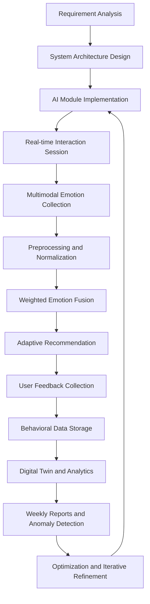
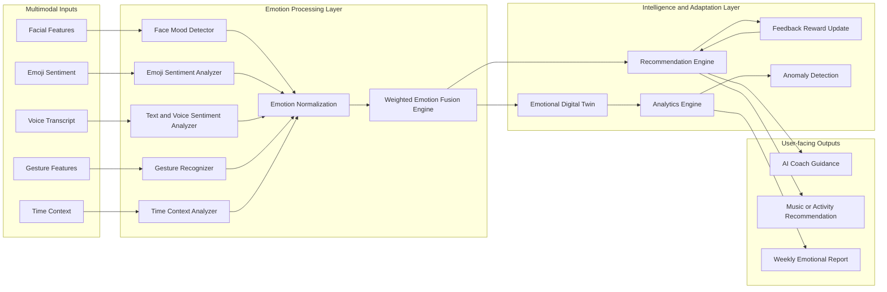
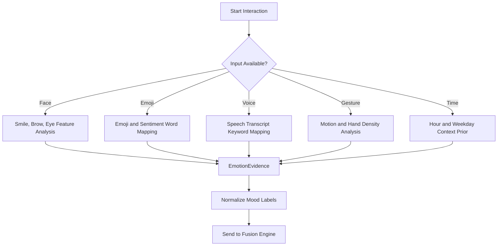
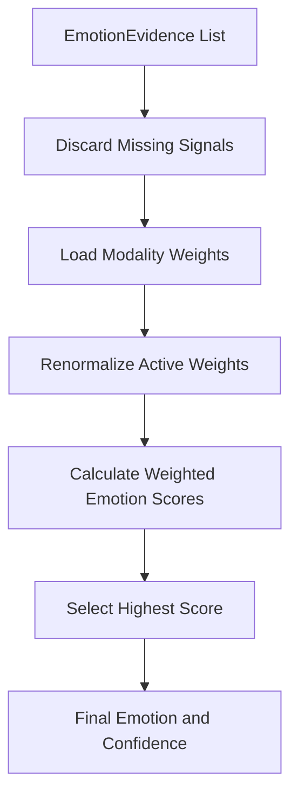
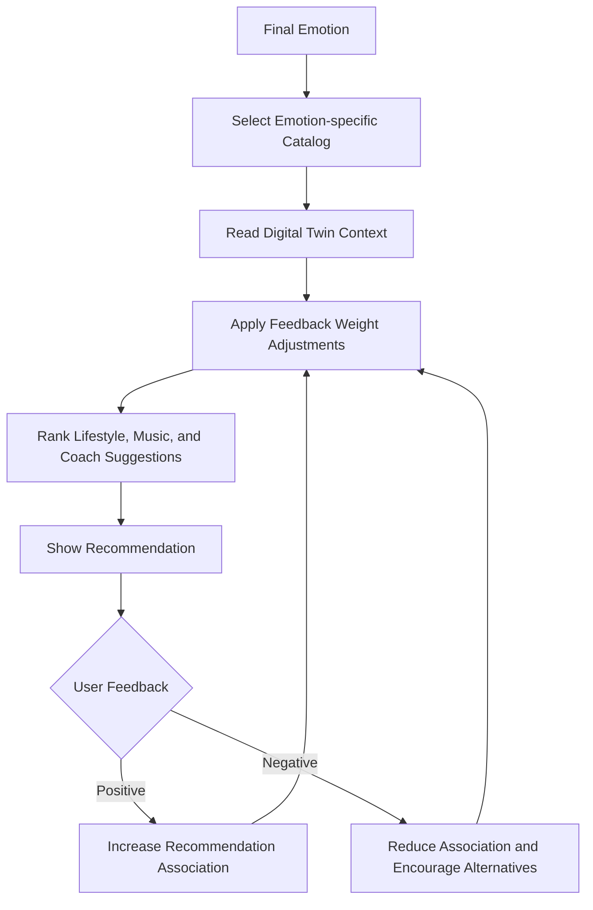
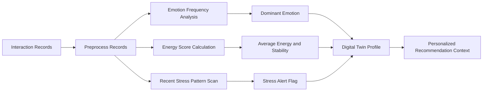
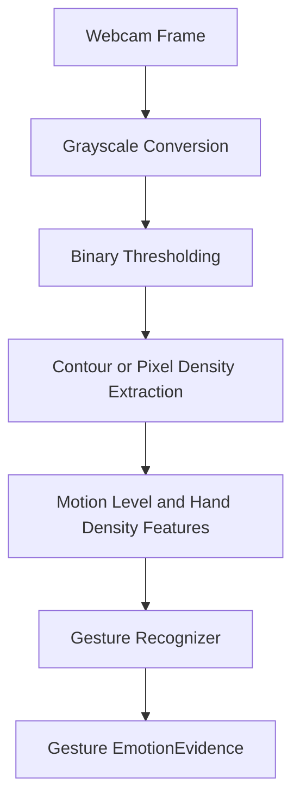
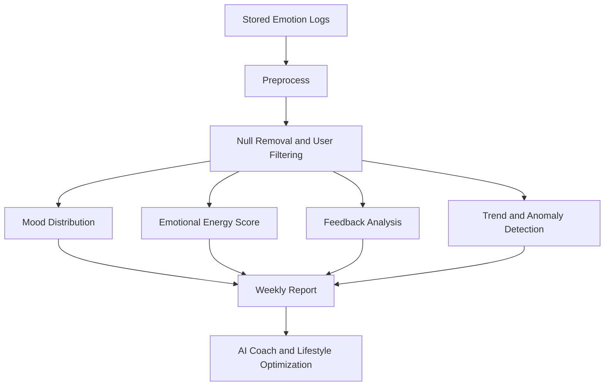

# Chapter 4 Research Methodology: System Architecture and Workflow

This document converts the Chapter 4 methodology into an implementation
architecture for the Cognitive Emotion Intelligence and Adaptive Lifestyle
System. The Python prototype in `src/cognitive_emotion_system` follows the same
modular workflow: multimodal emotion capture, preprocessing, weighted fusion,
adaptive recommendation, feedback learning, digital twin profiling, analytics,
and wellness reporting.

Downloadable Word version:
[`chapter4_workflow_architecture_models.docx`](chapter4_workflow_architecture_models.docx).

## 4.1 Methodology Used

The system is implementation-oriented and modular. Each modality is processed by
an independent analyzer, then normalized into `EmotionEvidence` objects. The
`EmotionFusionEngine` combines those signals using transparent reliability
weights, and the `RecommendationEngine` produces lifestyle, music, or coaching
actions. Historical interaction records feed the `DigitalTwin` and
`AnalyticsEngine` for behavioral pattern detection, emotional energy scoring,
weekly reporting, and anomaly alerts.

### Overall Research Workflow

### System Architecture Flowchart

## Multi-Modal Emotion Detection Strategy

The prototype accepts facial feature heuristics, emoji or short text sentiment,
voice transcript sentiment, gesture features, and time context. These inputs are
optional, allowing graceful operation even when webcam or microphone devices are
not available.

## Emotion Fusion Engine Design

The fusion engine uses weighted aggregation. The default reliability order gives
the strongest influence to face evidence, followed by emoji, voice, gesture, and
time context. Missing modalities are automatically excluded and the remaining
weights are renormalized.

Default modality weights implemented in `EmotionFusionEngine`:

| Modality | Weight |
| --- | ---: |
| Face | 0.35 |
| Emoji | 0.25 |
| Voice | 0.20 |
| Gesture | 0.10 |
| Time Context | 0.10 |

## Reinforcement Learning-Based Recommendation Method

The recommendation method is lightweight and reward-based. It does not require a
large reinforcement learning framework; instead, it updates item scores from
explicit or implicit user reward signals.

## Emotional Digital Twin Modeling

The emotional digital twin is a structured user profile created from historical
records. It calculates the dominant emotion, emotional stability, engagement
level, average energy, stress alerts, and emotion distribution.

## Gesture Recognition Methodology

The gesture recognizer follows the lightweight image-processing strategy
described in the methodology. In the default dependency-free prototype, the
recognizer consumes already-computed motion and hand-density features. A webcam
adapter can compute these features through grayscale conversion, thresholding,
and pixel-density analysis before calling the same recognizer.

## 4.2 Data Collection and Analysis

The storage layer records structured interaction data:

- user identifier
- timestamp
- modality evidence and confidence values
- final fused emotion
- recommendation id, category, title, reason, and score
- optional feedback reward

`JsonlStorage` is the default local storage implementation because it runs with
only the Python standard library. `ExcelStorage` is included as an optional
adapter for `.xlsx` files through OpenPyXL, matching the project methodology
while keeping the base prototype easy to execute.

### Data Analytics Workflow

## 4.3 Tools and Technology Used

The current implementation uses:

- Python for modular system development.
- Standard-library data structures for the core prototype.
- Optional OpenPyXL support for Excel-based `.xlsx` storage.
- Mermaid flowcharts for architecture documentation.
- Unit tests for fusion, recommendation orchestration, digital twin analytics,
  and anomaly detection.

Optional deployment adapters can add OpenCV, SpeechRecognition, PyAudio,
Pandas, Matplotlib, and Streamlit for webcam input, microphone input, dashboard
visualization, and richer reporting without changing the core architecture.
