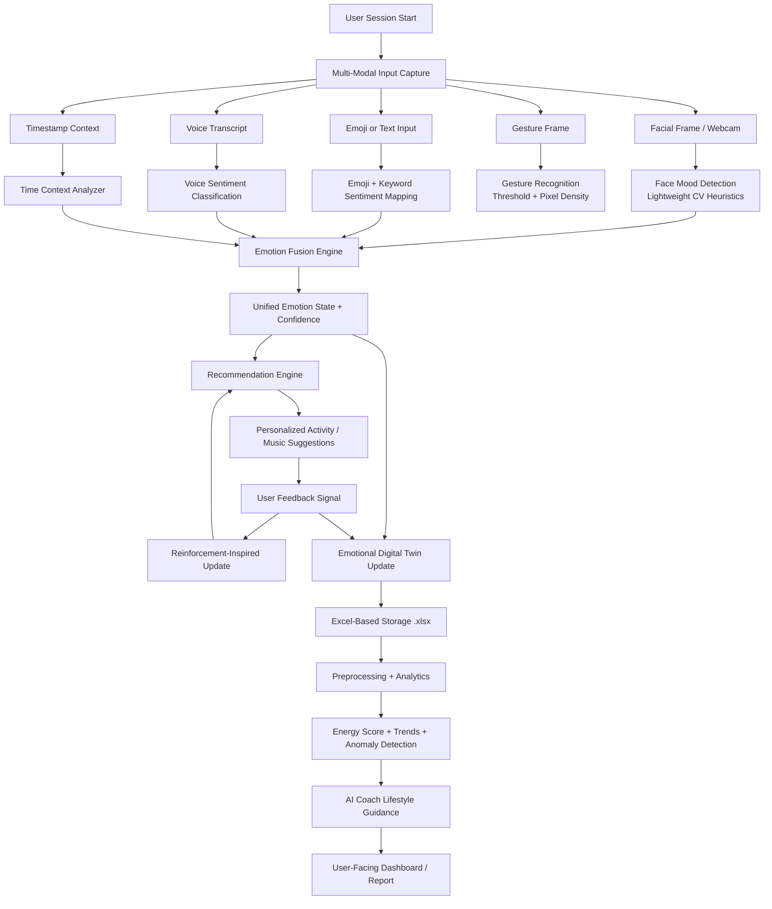
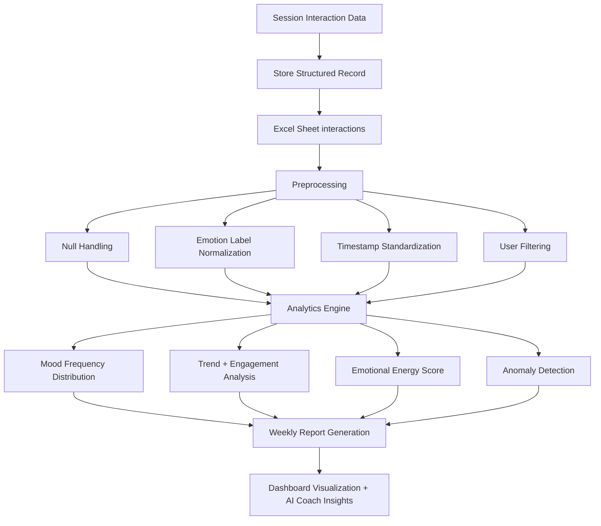

# Workflow Architecture Flowcharts (Chapter 4 Methodology)

## 1) End-to-End System Workflow



## 2) Emotion Fusion Model (Weighted Aggregation)

```mermaid
flowchart LR
    A1[Face Emotion + Confidence] --> W[Weighted Scoring]
    A2[Emoji Emotion + Confidence] --> W
    A3[Voice Emotion + Confidence] --> W
    A4[Time Context Emotion + Confidence] --> W

    W --> W1[Face Weight = 0.40]
    W --> W2[Emoji Weight = 0.30]
    W --> W3[Voice Weight = 0.20]
    W --> W4[Time Weight = 0.10]

    W1 --> S[Aggregate Vote Scores]
    W2 --> S
    W3 --> S
    W4 --> S

    S --> F1[Final Emotion = argmax(weighted votes)]
    S --> F2[Confidence = winning_weight / total_weight]
    S --> F3[Energy Index = signed weighted score]
```

## 3) Adaptive Recommendation Feedback Loop

```mermaid
flowchart TD
    A[Detected Fused Emotion] --> B[Select Candidate Recommendations]
    B --> C[Rank by Q-Value + Prior Bias]
    C --> D[Deliver Top Recommendation]
    D --> E[Capture User Feedback]
    E --> F{Reward Type}
    F -->|Positive| G[Strengthen Association]
    F -->|Negative| H[Penalize Association / Explore Alternative]
    G --> I[Q-value Update: Q <- Q + alpha*(r - Q)]
    H --> I
    I --> J[Updated Policy for Next Session]
    J --> B
```

## 4) Data Collection and Analysis Pipeline


